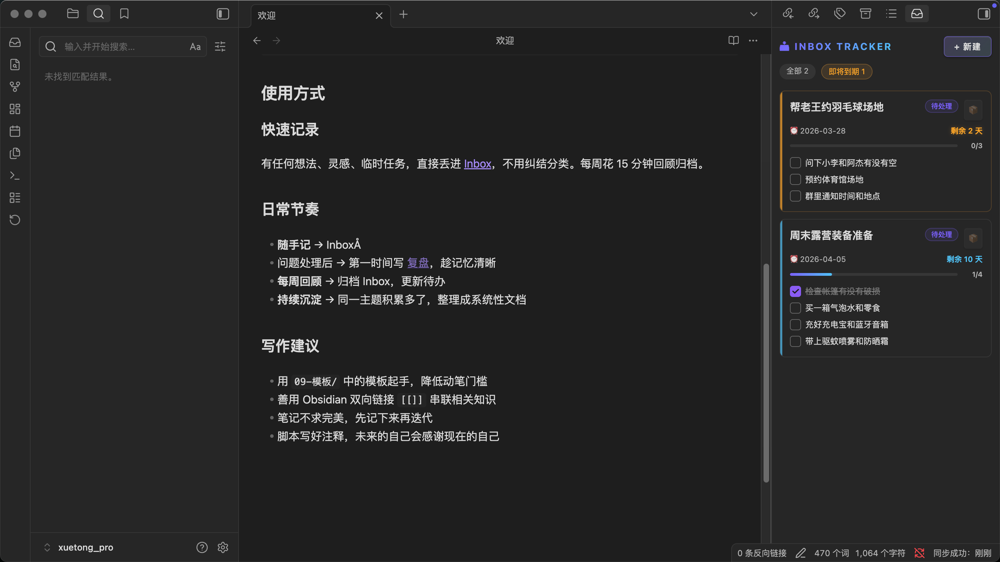
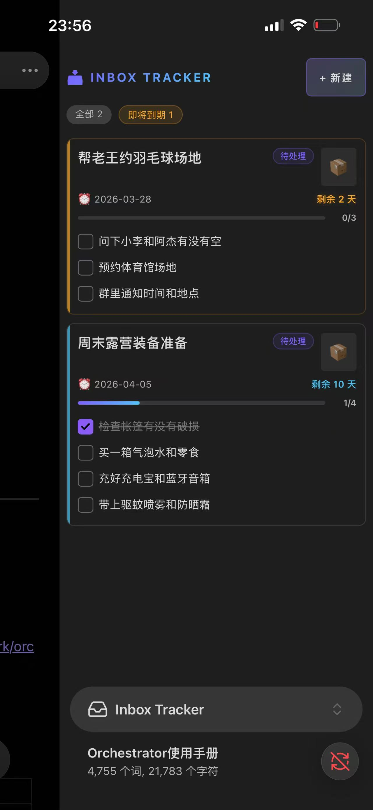
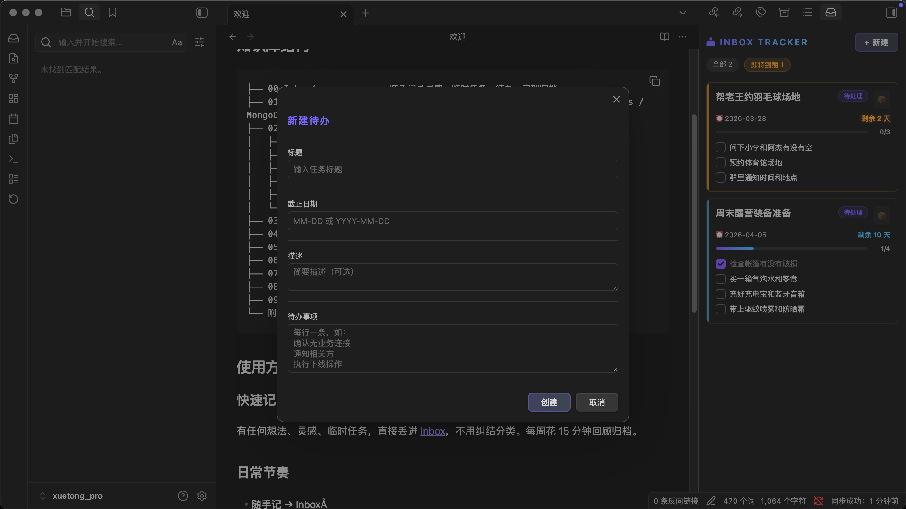

# 📥 Inbox Tracker

一款 Obsidian 插件，用于在侧边栏快速查看和管理待办任务。

## 截图

### 桌面端


### 移动端


### 新建待办


## 功能

- 自动扫描 Inbox 目录下的 Markdown 文件，解析标题、状态、截止日期、待办进度
- 按截止日期排序，过期红色标记，临近到期橙色提醒
- 点击标题直接跳转到对应文件
- 在面板中直接勾选/取消待办项
- 快速新建待办（标题、截止日期、描述、待办事项）
- 截止日期支持省略年份，输入 `04-03` 或 `4/3` 自动补全
- 归档已完成的任务
- 文件变动自动刷新面板
- 支持桌面端和移动端
- 可自定义设置（目录路径、紧急阈值等）

## 安装

### 推荐：通过 BRAT 安装（最简单）

1. 在 Obsidian 中安装 [BRAT](https://github.com/TfTHacker/obsidian42-brat) 插件（社区市场搜索 "BRAT"）
2. 打开 BRAT 设置，点击 **Add Beta plugin**
3. 输入 `xuetong-dbai/obsidian-inbox-tracker`，点击 **Add Plugin**
4. 进入 **设置 → 第三方插件**，启用 **Inbox Tracker**

后续更新也由 BRAT 自动处理。

### 手动安装

1. 前往 [Releases](https://github.com/xuetong-dbai/obsidian-inbox-tracker/releases) 下载 `main.js`、`manifest.json`、`styles.css`
2. 在 Vault 中创建目录 `<你的Vault>/.obsidian/plugins/inbox-tracker/`
3. 将三个文件放入该目录
4. 重启 Obsidian，进入 **设置 → 第三方插件**，启用 **Inbox Tracker**

### 从源码构建

```bash
git clone https://github.com/xuetong-dbai/obsidian-inbox-tracker.git
cd obsidian-inbox-tracker
npm install
npm run build
```

构建产物为根目录下的 `main.js`，连同 `manifest.json` 和 `styles.css` 一起复制到插件目录即可。

## 使用

### 打开面板

- 点击左侧边栏的 📥 图标
- 或使用命令面板搜索 `Open Inbox Tracker`

### 新建待办

1. 点击面板右上角 **+ 新建** 按钮
2. 填写标题、截止日期、描述、待办事项
3. 截止日期支持 `YYYY-MM-DD`、`MM-DD`、`MM/DD` 格式
4. 待办事项每行一条，自动生成 checkbox
5. 点击 **创建**，文件自动生成到 Inbox 目录

### 管理待办

- **勾选待办**：直接在面板中点击 checkbox，文件同步更新
- **查看详情**：点击任务标题，跳转到对应 Markdown 文件
- **归档任务**：hover 卡片后点击 📦 按钮，文件移至归档目录

### 设置

进入 **设置 → 第三方插件 → Inbox Tracker**，可配置：

| 设置项 | 默认值 | 说明 |
|--------|--------|------|
| Inbox 目录 | `00-Inbox` | 存放待办文件的目录路径 |
| 归档目录名 | `已归档` | 归档子目录名称 |
| 紧急天数阈值 | `3` | 多少天内标记为紧急（橙色） |
| 默认状态 | `待处理` | 新建任务时的默认状态文本 |
| 显示已完成待办 | `开启` | 是否在卡片中显示已勾选的待办项 |

### 文件格式

插件识别以下格式的 Markdown 文件：

```markdown
# 任务标题

- **状态**：待处理
- **截止日期**：2026-04-03

## 描述

任务描述内容

## 待办

- [ ] 待办事项 1
- [ ] 待办事项 2
- [x] 已完成事项
```

## 作者

ww.xuetong

## 许可

MIT
